# Civulator ↔ Breach — Cross-Project Overlap Map

Two games, one learning pipeline. Civulator is the active training ground;
Breach is the design target. What's learned in one should transfer to the other.

---

## At a Glance

```mermaid
graph TB
    subgraph SHARED["Shared Tools & Patterns"]
        GRID["Grid/Tile System<br/>(hex vs square, same pattern)"]
        SIM["Headless Simulation<br/>(step/reset, no rendering)"]
        ARRAYS["State as Stacked Arrays<br/>(multi-channel 2D tensors → CNN)"]
        PYBIND["C++ Core + pybind11<br/>(same build target plan)"]
        GYM["Gymnasium Interface<br/>(step, reset, reward, done)"]
        VIS["Visualization Layer<br/>(Pygame prototype → engine later)"]
        MATS["Data-Driven Lookup Tables<br/>(materials / terrain)"]
        PATH["Pathfinding on Grid<br/>(A* with cost functions)"]
        SELFPLAY["Self-Play / Multi-Agent RL"]
        MASK["Action Masking"]
    end

    subgraph CIV["Civulator (active)"]
        CIV_HEX["Hex grid, cylindrical wrap"]
        CIV_DQN["DQN + Build Agent"]
        CIV_ENCODE["StateEncoder abstraction"]
        CIV_UNITS["Unit types, combat, economy"]
        CIV_VIS["Pygame viewer (planned)"]
    end

    subgraph BREACH["Breach (design phase)"]
        BR_SQUARE["Square grid, spaceship interior"]
        BR_PHYSICS["Wave eq, diffusion, advection"]
        BR_LIGHT["2D raycasting + normal maps"]
        BR_CREATURES["Creature AI (NN-trained)"]
        BR_NARR["Narrative systems, news cycle"]
    end

    GRID --- CIV_HEX
    GRID --- BR_SQUARE
    SIM --- CIV_DQN
    SIM --- BR_PHYSICS
    ARRAYS --- CIV_ENCODE
    ARRAYS --- BR_PHYSICS
    VIS --- CIV_VIS
    VIS --- BR_LIGHT
    SELFPLAY --- CIV_DQN
    SELFPLAY --- BR_CREATURES

    style SHARED fill:#2d5a3d,color:#fff
    style CIV fill:#4a90d9,color:#fff
    style BREACH fill:#d94a4a,color:#fff
```



---

## Detailed Overlap Areas

### 1. Grid + Tile Architecture

| Aspect | Civulator | Breach | Overlap |
|--------|-----------|--------|---------|
| Grid type | Hex (offset coords) | Square | Different geometry, same pattern |
| Tile object | terrain, features, units, city | material, HP, fire, liquid, entities | Same hybrid: rich tile + cached arrays |
| Cached arrays | walkable, terrain cost | `_light_block`, `_gas_block`, `_walkable`, `_flammable` | Identical pattern — derive arrays from tiles |
| Cache invalidation | — | `on_tile_changed(x, y)` | Civulator should adopt this |
| Map wrapping | Cylindrical (horizontal) | None (ship interior) | Different |
| Adjacency | 6 hex neighbors (even/odd offset) | 4 cardinal (von Neumann) or 8 (Moore) | Different, but same structure |

**What transfers**: The Tile-object + cached-numpy-array hybrid. Breach designed it more explicitly (with `on_tile_changed`), Civulator could adopt that pattern. The material/terrain lookup table concept is identical.

---

### 2. Two-Layer Architecture (Simulation ↔ Presentation)

Both projects are designed with the same split:

```
Simulation Layer  ←→  Presentation Layer
(pure logic,          (rendering, input,
 no engine deps,       audio, UI)
 headless capable)
```

| Aspect | Civulator | Breach |
|--------|-----------|--------|
| Simulation interface | `step()`, `reset()`, `get_valid_actions()` | `get_state()`, `apply_action()`, `step()` |
| Headless training | Yes — current primary mode | Planned — same design |
| Engine independence | Pure Python, no rendering deps | Simulation layer has no engine dependency |

**What transfers**: The entire architectural philosophy. Civulator validates the approach; Breach inherits it. Any tooling built for one (replay logging, state serialization) works for both.

---

### 3. State as Multi-Channel 2D Tensor → CNN

Both encode game state as stacked 2D arrays, fed directly to convolutional neural networks.

| Aspect | Civulator | Breach |
|--------|-----------|--------|
| State shape | `[C, H, W]` — 5 or 25 channels on hex grid | Stacked cached arrays — pressure, smoke, fire, etc. |
| CNN input | `BasicStateEncoder` (5ch) / `EnhancedStateEncoder` (25ch) | Stack arrays into channels, feed to CNN (AlphaStar-style) |
| Normalization | Stats normalized to [0, 1] | Physical quantities (0-1 atm, 0-1 smoke density) |
| Sparsity | Units on ~10% of tiles | Similar — entities sparse on ship grid |

**What transfers directly**:
- The `StateEncoder` abstraction (ABC with `encode()` and `get_tensor_shape()`)
- Cylindrical wrap padding concept (not the wrap itself, but the idea of topology-aware padding)
- Relationship-based encoding (own/ally/enemy rather than player IDs)
- Normalization conventions

---

### 4. Python Prototype → C++ Production Pipeline

Both follow the exact same language pipeline:

```
Python + NumPy (prototype)  →  C++ + pybind11 (production)
                                    ↓
                            Two build targets:
                            - Engine plugin (.dll)
                            - Python module (.pyd) for RL training
```

| Aspect | Civulator | Breach |
|--------|-----------|--------|
| Current stage | Python prototype (active) | Design phase |
| Prototype stack | Python, NumPy, PyTorch | Python, NumPy (planned) |
| Production plan | C++ core, pybind11, PyTorch | C++ core, pybind11, engine plugin |
| GPU training | RTX 3070, PyTorch 2.6 CUDA | Same hardware available |

**What transfers**: Everything. The pybind11 build system, CMake config, zero-copy array sharing — build it once for Civulator, reuse for Breach.

---

### 5. Visualization / Graphics

**This is the biggest opportunity to avoid duplicate work.**

| Aspect | Civulator | Breach |
|--------|-----------|--------|
| Current state | ASCII only | Design docs only |
| Planned prototype | Pygame (recommended in research doc) | "Easy plotting" / Matplotlib initially |
| Production target | Pygame polished or browser-based | Unity/Godot with 2D raycasting + normal maps |
| What's needed now | Hex grid renderer, unit sprites, terrain colors | Tile grid renderer, wall/room visualization |
| RL overlay needs | Value function heatmaps, policy arrows, attention maps | Pressure/smoke/fire field visualization |

**Shared visualization needs** (build once, use twice):

1. **Tile grid renderer** — Pygame function that draws a 2D grid of colored tiles with overlays. Civulator needs hex, Breach needs square. Both need:
   - Tile coloring by category (terrain/material)
   - Entity markers on tiles
   - Scalar field overlay (heatmap style) — Civulator for value functions, Breach for pressure/smoke/fire
   - Camera pan + zoom

2. **Scalar field visualization** — Both projects need to render 2D numpy arrays as colored overlays on the grid:
   - Civulator: Q-value heatmaps, threat maps, settlement value maps
   - Breach: pressure field, smoke density, fire intensity, atmosphere, light map
   - Same rendering code: `array → colormap → alpha overlay on grid`

3. **Replay system** — Both need state-logging to JSONL and a replay viewer:
   - Log state dict each turn
   - Viewer loads JSONL, scrubs through turns
   - Same format, same viewer code (different state fields)

4. **Matplotlib quick plots** — Both can use the same pattern for quick static renders during development:
   - `imshow()` for scalar fields
   - Patch-based tile rendering (hex polygons / rectangles)
   - Same for both, just different tile shapes

**Recommendation**: Build a small shared `grid_viz` module:
```python
# grid_viz/
#   __init__.py
#   pygame_renderer.py   — TileGridRenderer base + HexRenderer + SquareRenderer
#   field_overlay.py     — numpy array → RGBA overlay (colormap + alpha)
#   replay_logger.py     — log state dicts to JSONL
#   replay_viewer.py     — load JSONL, scrub, render
#   matplotlib_quick.py  — quick static renders for debugging
```

---

### 6. RL / Neural Network Training

| Aspect | Civulator (active) | Breach (planned) |
|--------|-------------------|-----------------|
| Agent type | DQN (select-and-move) + Build Agent | Neural network creature AI |
| Training mode | Self-play, 2-player | Self-play planned for tactical agents |
| Action space | Select unit → move/attack | Creature decisions per turn |
| Gymnasium API | Yes (`step`, `reset`, `reward`, `done`) | Planned (same interface) |
| Action masking | Implemented (select mask, move mask, build mask) | Will need it (valid moves per creature) |
| Replay memory | Standard, per-agent | Same pattern |
| Multi-agent | 2 agents per game (one per player) | Multiple creatures + player squads |

**What transfers**:
- `ReplayMemory` class — identical
- Action masking infrastructure
- Multi-agent pending transition mechanism (agent acts, waits for next turn)
- Self-play with opponent pool
- Training loop structure (episode loop, checkpoint, eval)
- All the Rainbow DQN improvements being developed in Civulator

**Key insight from Civulator's research doc**: The progression DQN → PPO → AlphaZero applies to both games. Civulator is walking this path now. Breach's creature AI can start wherever Civulator has reached.

---

### 7. Pathfinding

| Aspect | Civulator | Breach |
|--------|-----------|--------|
| Current | Greedy (broken, A* planned) | Not implemented yet |
| Grid type | Hex | Square |
| Cost function | Terrain movement cost | Movement cost through rooms/doors |
| Obstacles | Mountains, units | Walls, fire, decompression zones |

**What transfers**: A* implementation. The algorithm is grid-agnostic — only the neighbor function and cost function change. Build a generic `astar(start, goal, neighbors_fn, cost_fn, heuristic_fn)` that both games call with their own neighbor/cost functions.

---

### 8. Data-Driven Lookup Tables

Identical pattern in both projects:

**Civulator** — Terrain properties:
```python
TERRAIN = {
    "Plains":    {"food": 1, "prod": 1, "move_cost": 1, "defense": 0},
    "Hills":     {"food": 0, "prod": 2, "move_cost": 2, "defense": 3},
    ...
}
```

**Breach** — Material properties:
```python
MATERIAL_PROPERTIES = {
    Material.STEEL:  {"max_hp": 200, "flammable": False, "blocks_light": True, ...},
    Material.WOOD:   {"max_hp": 60,  "flammable": True,  "blocks_light": True, ...},
    ...
}
```

**What transfers**: The pattern itself. One dict, all properties derive from it, level editor paints types, everything auto-derives. Civulator already does this; Breach designed it independently and arrived at the same solution.

---

## Priority: What to Build Shared

### Build Now (during Civulator development)
1. **A\* pathfinding** — generic, grid-agnostic. Civulator needs it immediately; Breach will need it.
2. **Pygame tile renderer** — start with Civulator's hex grid, design the interface so square grid is a subclass swap.
3. **Scalar field overlay** — numpy array → colored overlay. Civulator needs it for value/threat maps, Breach for physics fields.
4. **Replay logger** — state dict → JSONL. Trivial to make generic.

### Build When Breach Prototyping Starts
5. **StateEncoder abstraction** — already exists in Civulator, port directly.
6. **pybind11 build system** — build for Civulator's C++ phase, reuse for Breach.
7. **ReplayMemory + training loop** — already working in Civulator.

### Don't Share (different enough to be separate)
- Hex vs square adjacency (different math, not worth abstracting)
- Game-specific simulation logic (physics vs economy)
- Breach's 2D raycasting / normal map system (specific to Breach's presentation layer)
- Narrative/lore systems (Breach-only)

---

## Summary

The projects share **architecture and tooling**, not game logic. The right strategy:
build generic tools during Civulator development, then plug them into Breach.

| Layer | Shared? | Notes |
|-------|---------|-------|
| Game simulation | No | Different games, different rules |
| Grid/tile pattern | Yes (pattern) | Same architecture, different geometry |
| State encoding → CNN | Yes | Same abstraction, different channels |
| RL training infrastructure | Yes | Same loop, same algorithms |
| Visualization prototype | **Yes — high value** | Same renderer, different tile shapes |
| Scalar field rendering | **Yes — high value** | Identical need in both projects |
| A* pathfinding | **Yes — high value** | Generic algorithm, plug in neighbors/cost |
| C++ + pybind11 pipeline | Yes (when ready) | Build once, use twice |
| Production graphics | No | Breach needs engine-grade 2D lighting; Civulator needs Pygame/browser |
| Narrative/lore | No | Breach-only |
