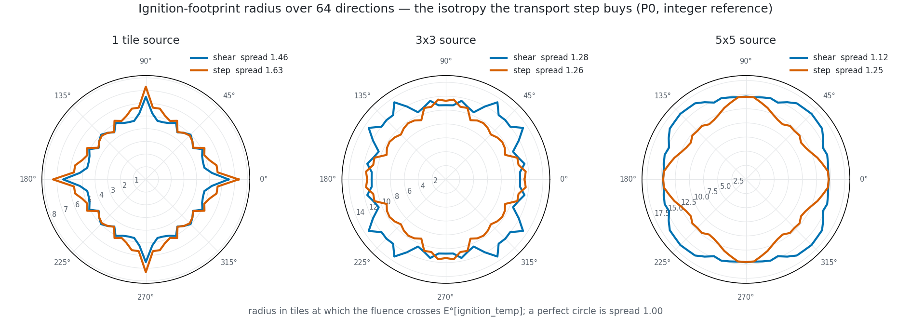
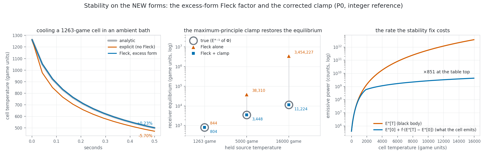

# P0 — the integer reference, and what it measures (2026-09-15)

> **Patch:** P0 of the ray-engine-v2 arc (`docs/ray_engine_v2_design_v3_2026-09-15.md`
> §11), issue #12, branch `12-p0-integer-reference-sweep`.
> **Nothing in the engine changed.** This patch is a measuring instrument, its
> gates, and the numbers the design promised.
>
> **Depends on:** design v3 §§2.3–2.9, 3, 11 · `ray_engine_v2_critique_3_determinism_cuda_2026-09-15.md`
> §§1–4 (whose throwaway probe is this reference's starting point) · `sweep_ref.py`
> (the float push reference) · `stability_study.py` (the tables re-run here).
>
> **What shipped**
>
> | file | what it is |
> |---|---|
> | `sweep_ref_q.py` | THE integer reference: §2.3 in gather form, both transports, the leak, the virtual ambient ring, the body share **with ambient re-emission** (row 25), the excess-form Fleck factor, the E° bake + `E°⁻¹`, and a model of the Pass-1 solid fold with the corrected clamp and both rails |
> | `sweep_ref_q_gates.py` | the twelve gate groups below; prints measured numbers, exits non-zero on any failure. `--fast` shrinks grids and tick counts, never coverage |
> | `p0_figures.py` | the two figures and the characterisation tables quoted here |
> | `tests/test_ray_engine_v2_integer_reference.py` | the gates as pytest, 13 tests, 1.5 s |
>
> Re-run: `C:/Users/steen/anaconda3/python.exe sweep_ref_q_gates.py` (about 80 s) and
> the same interpreter on `p0_figures.py`.

---

## 0. What did NOT hold, and what surprised me

Read this section first. Everything else is the gate table and its detail.

### 0.1 The design's "Fleck alone" equilibrium column was measured at a different alpha

Design §2.8 quotes `845 / 18 982 / 1 727 794` for the Fleck-only equilibrium at
1263 / 5000 / 16 000-game sources. Those numbers come from `stability_study.py`'s
`equilibrium(G, T_src, 0.5)` — **alpha fixed at 0.5**. Design v3 §2.8 specifies
`alpha = max(0.5, 1 - 1/g)`, which rises toward 1 in exactly the stiff regime, and
under its own alpha the Fleck-only equilibrium is **twice as far out**:

| source | design v3 quotes | **measured, v3's own alpha** |
|---|---|---|
| 1263 game | 845 | **844** |
| 5000 game | 18 982 | **38 310** |
| 16 000 game | 1 727 794 | **3 454 227** |

The algebra is the same `f = T_abs / max(T_abs + 2L, 4L)` that critique 3 and this
reference both confirm; it is the *comparison column* in the design that is stale.
The `true` and `Fleck + clamp` columns are unaffected (§7). **Nothing to fix in the
scheme; the design's table should be re-labelled** — it currently reads as if the
clamp buys x150 where it actually buys x300.

### 0.2 The "+2.2 % above the analytic cooling curve" is not reproducible

Design §2.8 and `stability_study.py`'s prose both say the Fleck factor lands 2.2 %
above the analytic cooling curve where explicit lands 5.8 % below. Explicit
reproduces exactly (-5.84 % on the old law, -5.70 % on the new one). The Fleck
figure does not: `stability_study.py`'s **own section 5** prints `+0.2 %` at
alpha = 0.5, and this reference measures **+0.15 %** (old law) and **+0.23 %** (new
law). The 2.2 % appears only in that file's docstring, and the design inherited it.
The error is in the *favourable* direction — the Fleck form is an order of
magnitude closer to the analytic solution than the design claims.

### 0.3 "Shear is rounder at every source size" depends on the ambient ring

With the ambient inflow **off** — the configuration `reach_and_leak_study.py` §5b
used, which the design quotes — the integer reference reproduces the published
table to three digits (§6). With the design's **own virtual ambient ring on**, the
ordering flips at one of the three source sizes:

| source | shear (ring on) | step (ring on) | shear (ring off) | step (ring off) |
|---|---|---|---|---|
| 1 tile | **1.459** | 1.627 | **1.369** | 1.635 |
| 3x3 | 1.277 | **1.262** | **1.218** | 1.319 |
| 5x5 | **1.123** | 1.248 | **1.173** | 1.251 |

It is not sampling noise: at 256 directions and a 0.05-tile radial step the gap
widens to shear 1.335 against step 1.259. The mechanism is that the ambient floor
moves the ignition crossing outward (shear's 3x3 crossing goes 11.20 to 11.55
tiles) into a ring where shear's 16-lobe star is stronger. **The decision is
untouched** — shear wins decisively for a single burning tile (1.46 vs 1.63) and
for a 5x5 fire (1.12 vs 1.25), which are the cases that matter — but the quoted
table should say which configuration produced it.

### 0.4 The damped source is NOT monotone in temperature above the fire range

`f * (E°[T] - E°[0])` — what a cell actually radiates — rises strictly through the
whole fire range and then **wobbles**: 453 backward steps for wood, worst 2.47 % in
power (0.61 % in a receiver's equilibrium temperature). The mechanism is `f_q`'s
own Q16 resolution: at the table top `f_q` is 38 counts for wood, so one count of
`f_q` is 2.6 % of it. It is bounded, it never inverts the cooling map (a 4-game
bucket step changes the loss by about 2 game, less than the step itself), and the
cooling gate is monotone in time from every start. But it is a real artefact and it
scales as `1/f_q`:

| material row | a | log2(thermal_mass) | `f_q` at the table top | first backward step | worst wobble |
|---|---|---|---|---|---|
| wood / door | 1.00 | 3 | 38 | 5168 game | **2.47 %** |
| hull / steel | 1.00 | 5 | 154 | 7444 game | 0.55 % |
| furniture / kindling | 0.50 | 3 | 77 | 6212 game | 1.18 % |
| glass | 0.30 | 4 | 257 | 8488 game | 0.29 % |
| *(no material ships this)* | 1.00 | **0** | **4** | 2960 game | **19.89 %** |

**Recommendation for P1**: make `heat_atten > 0` imply `thermal_mass >= 8` at the
ingress door, beside the design's existing `heat_atten > 0` implies
`thermal_mass > 0`. Every shipped absorbing material already satisfies it; a future
`thermal_mass = 1` absorber would quantize its own plasma emission in 25 % steps.
(The alternative is computing `f` in a wider fixed point — Q24 — which costs
nothing but a shift, and which P1 may prefer if a low-thermal-mass absorber is ever
wanted.)

### 0.5 The runaway the clamp prevents is not representable in the engine's temperature field

`temperature` is int32 Q16.16, so its ceiling is **32 768 game**. The Fleck-only
equilibrium of 3 454 227 game exists only in unbounded arithmetic:

| arithmetic | equilibrium |
|---|---|
| unbounded ints (the study's number) | 3 454 227 game |
| int32 Q16.16 with `sat_add_q16` | 32 768 game (pinned at INT32_MAX) |
| + the `T_MAX_PHYS` rail | 16 000 game, `t_max_phys_hits` firing **every tick** |

Consequence for gate 4's wording: "`t_max_phys_hits` is not reachable through the
radiative sub-step" is true **only while the clamp is enabled**. Gate 5's
non-vacuity run (`clamp_enabled=False`) *will* light that counter, and P1's test
must expect it rather than assert it stays zero.

### 0.6 In the 2-D sweep the clamp buys far less than the 0-D table suggests

A cold crate one tile from a held 16 000-game source settles at **1 104 game**
clamped and **1 212 game** unclamped — 10 %, not x150. Two measured reasons:

- The sweep's own geometric factor at that distance is **0.09**, not the 0.25 the
  0-D tables assume. Measured `G = (Phi - E°[0]) / E°[T_src]`:

  | transport | 1 tile | 2 tiles | 3 tiles | 4 tiles | diagonal (1,1) |
  |---|---|---|---|---|---|
  | shear | 0.1414 | 0.0939 | 0.0687 | 0.0529 | 0.1082 |
  | step | 0.2497 | 0.1552 | 0.1079 | 0.0799 | 0.0945 |

  So "G = 0.25 is roughly an adjacent tile" is right for step and x1.8 optimistic
  for shear.
- The Fleck factor damps a table-top source's emission by **x851**, so a plasma
  tile delivers 0.117 % of its black-body power to its neighbours.

The clamp still fires (17 hits in 24 ticks on that scene) so gate 4 is not vacuous,
and the 0-D equilibrium table is still the right statement of the *scheme's* bias.
But "one tile from a 16 000-game source runs to 1.7 million" is a 0-D statement and
should not be read as a sweep prediction. **This is P2's problem, not P0's**: the
derived calibration has to be done against the *damped* emission, or reach at fire
temperatures will come out wrong.

A sanity check in the other direction, and the best single argument that the scheme
is physical: **a cell fully ringed by 1263-game walls receives G = 0.9987 and
`E°⁻¹(Phi) = 1256 game`** — a cavity reaches its wall temperature, to within one
4-game bucket.

### 0.7 Two things that held better than the design claimed

- **The body's ambient re-emission fixes more than the low rail.** Critique 3's
  probe measured the uniform-ambient fixed point with **bodies absent** (its probe
  [2]). With Erik's amendment the per-cell fixed point holds **with bodies
  present** — 43 body cells, both transports, S16 and S12, leak on, all three
  planes exactly zero. That is the gate the design wanted and could not previously
  have had.
- **The integer gather reproduces the float push footprint exactly.** Not "to the
  shift truncation" — identically, to three decimals in both mean radius and
  spread, for both transports (§6).

---

## 1. The gate table

`C:/Users/steen/anaconda3/python.exe sweep_ref_q_gates.py` — **all pass**. Grids
are small on purpose; every configuration listed is run.

| gate | what it asserts | measured | verdict |
|---|---|---|---|
| **G1** conservation | `sum(rad_net) + sum(rad_flux) + sum(rad_amb) == 0` exactly, int64, random `a`/`d>=a`/`k`/`T`/`f`, both transports, S16+S12, leak on+off, bodies present; each sum individually non-zero | `identity = 0` in all **8** configurations; e.g. shear k=0 S16 `net = -4 994 924 047 174`, `flux = +3 275 754 000 553`, `amb = +1 719 170 046 621` | PASS |
| **G2a** uniform ambient | every cell of all three planes exactly 0, bodies present, leak on, non-dyadic `a`, S16+S12, both transports | `0` non-zero cells in all 4 runs (43 body cells). Non-vacuous: the pure-sink body gives **186** non-zero cells (min `rad_net` -199 179); the v2 whole-emission Fleck gives **111** counts per ordinate | PASS |
| **G2b** isothermal box | inner wall layer exactly 0 with `f = 0.3` forced, S16+S12, both transports; outer layer legitimately negative | inner `max abs(rad_net) = 0` and interior air `= 0` in all 4 runs; outer minimum **-54 809 448** (shear S16) down to **-45 042 138** (step S12) | PASS |
| **G3** positivity + ingress | no negative stream; `a > d`, `d > ONE`, `k > ONE` raise | `min stream = 24 342` (= `amb_m`) against `max stream = 187 714 378 332`, so the scenes are not empty; all three illegal planes raise, the legal one is accepted | PASS |
| **G4** counters, per counter | marine beside an ambient wall: low rail, clamp and `T_MAX_PHYS` all zero over 24 ticks; over-driven scene: clamp non-zero | re-emitting body: `low_rail = 0`, `clamp = 0`, `t_max = 0`, wall `rad_net = [0,0,0,0,0,0,0]`. **Non-vacuous**: the pure-sink body gives `low_rail = 168` (7 wall cells x 24 ticks), wall `rad_net = [-4893, -9182, -37 992, -49 638, -37 992, -9182, -4893]` — critique 3 §4f reproduced exactly. Positive: a body one tile from a 1263-game fire books `rad_flux = 28 221 926`. Over-driven: `clamp = 17`, `t_max = 0`, `low_rail = 0` | PASS |
| **G5** maximum principle | `T_new <= max(T_before, E°⁻¹(Phi))` per cell on the radiative sub-step | worst excess **0 counts** over 24 ticks, 17 clamp engagements. Non-vacuous: clamp off gives crate 1211.7 vs 1104.0 game (cap 8724); the 0-D G=0.25 model runs to **3 454 227** game; a burning crate at 1263 game with `E°⁻¹(Phi) = 0` is **not** clamped (0 hits, cools 1263 to 1053.7) where the bare v2 form would have set it to 0 in one tick | PASS |
| **G6** isotropy | ring MAX/MIN + the 64-direction footprint, shear vs step, 1-tile / 3x3 / 5x5, leak 0.10 | §6's table; shear rounder at 1 tile (1.459 < 1.627) and 5x5 (1.123 < 1.248); **not** at 3x3 (§0.3). Integer vs float footprint identical: `r = 4.583 spread = 1.369` (shear), `r = 5.215 spread = 1.635` (step) | PASS |
| **G7** float agreement | integer gather vs the float push reference | vs `sweep_ref.py` itself (no bodies): ratio **9.79e-07** (shear), **7.92e-07** (step). vs the push port with bodies: **1.13e-06** / **1.66e-07**. Bound asserted: < 1e-4 | PASS |
| **G8** Fleck integer form | within one count of `1/(1+alpha*g)`, `alpha = max(0.5, 1-1/g)`, over the whole table; `f_q == ONE` iff `L_q == 0` | worst `abs(f_q/ONE - f_float)` = **1.53e-05** = exactly one count, over **4000 buckets x 5** `(a, his)` pairs; the iff holds | PASS |
| **G9** `E°⁻¹` | idempotent, both edge cases | `E°[E°⁻¹(Phi)] <= Phi` on 8 boundary probes including `E°[3999]` and `3*E°[3999]`; `E°⁻¹(E°[0]-1) = 0`; `E°⁻¹(3*E°[3999]) = 15 996` game < `T_MAX_PHYS`; `E°⁻¹(E°[b]) == 4b` for **every** bucket | PASS |
| **G10** stability + equilibrium | the tables on the new forms | §7; Fleck +0.23 % vs explicit -5.70 %; monotone, positive, finite from every start to the table top; the clamp reproduces `E°⁻¹(Phi)` exactly at all three sources | PASS |
| **G11** headroom | per-cell sums < 2^46, no product near 2^63 | table-top scene, `a = 1`: max stream 2^37.6, `max abs(rad_net)` 2^41.1, max fluence 2^41.6, max product 2^53.7. Transparent room with table-top emitters: `max abs(rad_net)` 2^41.7 | PASS |

Also gated: **the config dials have not drifted** — `rad_scale = 5.1427e-05`,
`kelvin_ambient = 293`, `k_temp_to_kelvin = 1`, `T_MAX_PHYS = 16000` are read from
`config.toml` and compared, because a retune silently invalidates every number here.

---

## 2. What the reference is

`sweep_ref_q.py` is **pure Python ints**, so overflow is impossible and every
headroom question is measured rather than argued. It transcribes, one function
each:

| function | transcribes |
|---|---|
| `bake_e_table` | `cpp/src/raycaster.cpp:62-97` — bucket midpoints, `K^4` by repeated int64 multiplication, the one `(double)k4 * scale + 0.5` boundary |
| `e_bucket_of` | `cpp/src/raycaster.h:203-213` |
| `e_inv_q` | design §2.6 — a **fixed 12-trip binary lifting** (2048, 1024, ... 1), branch-uniform for host and device in the `sqrt_q16_dev` idiom, returning the bucket's **low edge**; `Phi < E°[0]` gives 0; saturation at 15 996 game |
| `shr_round0`, `floordiv_q`, `sat_add_q16` | `fixed_point.h:410`, `:562`, `:400` |
| `fleck_f_solid_q` | design §2.8, the **excess** form |
| `sweep_q` | design §2.3 in gather form, including `emit_body` (row 25) |
| `fold_pass1_solid` | `temperature_solver.cpp:247-299` + the clamp in its corrected form (row 21), with `t_max_phys_hits` / `t_low_rail_hits` / `rad_clamp_hits` |

Three knobs exist only so the gates cannot pass vacuously, and each is named in the
file: `body_mode="sink"` (the pre-ruling pure-sink body), `clamp_enabled=False`
(P1's binding keyword), and `e_ref=0` (the float study's zero-sky configuration).

`E°[0] = 389 475`, `E°[3999] = 3 622 281 227 645 = 2^41.7`, `amb_m(S16) = 24 342`.

---

## 3. Conservation, the fixed points, and the body (G1, G2a, G2b)

The identity is exact in every configuration, and each of its three terms is
individually large — the gate would pass trivially if `rad_flux` were always zero,
so it asserts otherwise:

| transport | k | S | sum rad_net | sum rad_flux | sum rad_amb | identity |
|---|---|---|---|---|---|---|
| shear | 0 | 16 | -4 994 924 047 174 | 3 275 754 000 553 | 1 719 170 046 621 | **0** |
| shear | 0.10 | 12 | -10 816 558 575 832 | 2 648 079 244 205 | 8 168 479 331 627 | **0** |
| step | 0 | 16 | -4 377 070 843 028 | 812 814 471 932 | 3 564 256 371 096 | **0** |
| step | 0.10 | 12 | -6 166 060 350 780 | 3 552 091 806 659 | 2 613 968 544 121 | **0** |

(all eight rows are in the gate output; four are shown.)

**The body's ambient re-emission (row 25) is what makes the ambient fixed point
survive bodies.** At exact ambient `abs_body == emit_body` by the same integers, so
`i_out == amb_m` and all three planes stay zero. Without it the same scene has 186
non-zero cells, and on the marine-beside-a-wall scene every wall cell in the shadow
loses 49 638 counts a tick and the low rail fires 7 times a tick. Both are measured
above.

The **enclosed isothermal box** is the non-vacuous half of the second law (critique
3 §4b): the inner layer of a two-cell-thick 1263-game wall is an exact per-cell
zero with `f = 0.3` forced, because every gather it receives is another `T0` cell's
`src` split and re-summed under the same shift. The outer layer legitimately cools
to the sky (-54.8 M counts at S16 shear).

---

## 4. Positivity, `E°⁻¹` and headroom (G3, G9, G11)

- The stream never goes negative; its floor is exactly `amb_m = 24 342`, the ring's
  own value, which is the right floor: a cell with nothing upwind still sees the
  ambient sky.
- `E°⁻¹` is idempotent by construction (`e_bucket_of((4b) << 16) == b`), returns 0
  below `E°[0]`, and saturates at **15 996 game — four game units below
  `T_MAX_PHYS`**. On the radiative sub-step the clamp therefore always binds first
  and the `T_MAX_PHYS` rail is unreachable *while the clamp is enabled* (§0.5).
- Headroom, measured on a grid seeded at the table top with `a = 1`: streams reach
  2^37.6, per-cell sums 2^41.7, and the widest intermediate product 2^53.7. The
  design's "< 2^50" and critique 3's "< 2^46" both hold with room; nothing is
  within nine bits of int64.

---

## 5. Agreement with the float push reference (G7)

The gather form is compared against **the committed `sweep_ref.py`** on a scene
with no bodies and `f = 1`, where the two are algebraically identical, and against
a push port carrying the body terms on a scene with bodies:

| comparison | max abs(int - float) | max abs(rad_net) | ratio |
|---|---|---|---|
| shear vs `sweep_ref.py` | 3 526 978 | 3 603 369 262 685 | **9.79e-07** |
| step vs `sweep_ref.py` | 2 309 919 | 2 915 188 273 634 | **7.92e-07** |
| shear vs the push port, bodies | 4 027 961 | 3 570 807 786 078 | **1.13e-06** |
| step vs the push port, bodies | 602 778 | 3 622 279 475 556 | **1.66e-07** |

That is the shift truncation and nothing else: about 1e-6 relative, against an
asserted bound of 1e-4. Design rows 23 (gather form) and 25 (body re-emission) are
**measured**, not derived.

---

## 6. Isotropy (G6)

Measured on an 81x81 grid, a 1263-game source, leak `k = 0.10`, the ambient ring
on, threshold `E°[280] = 5 621 634`:

| source | transport | mean r_ign | min r | max r | spread | ring max/min at r = 1 / 2 / 3 / 5 / 8 |
|---|---|---|---|---|---|---|
| 1 tile | shear | 4.93 | 4.46 | 6.51 | **1.459** | 1.30 / 1.94 / 1.79 / 1.75 / 1.45 |
| 1 tile | step | 5.27 | 4.49 | 7.31 | 1.627 | 2.90 / 2.40 / 2.10 / 2.04 / 1.91 |
| 3x3 | shear | 11.55 | 10.48 | 13.38 | 1.277 | 1.64 / 1.32 / 1.07 / 1.29 / 1.40 |
| 3x3 | step | 10.18 | 9.17 | 11.57 | **1.262** | 1.50 / 1.07 / 1.50 / 1.66 / 1.84 |
| 5x5 | shear | 15.33 | 14.62 | 16.42 | **1.123** | 1.00 / 1.00 / 1.03 / 1.14 / 1.17 |
| 5x5 | step | 12.93 | 11.72 | 14.63 | 1.248 | 1.00 / 1.00 / 1.37 / 1.46 / 1.79 |

The picture shows what the numbers cannot: for a single tile **both** transports
produce a four-pointed star on the axes, and step's points reach 7.3 tiles where
shear's reach 6.5 while both have the same 4.5-tile waist — step is the less round
one because its spikes are longer, not because its body is thinner. At 3x3 shear's
16 lobes are plainly visible (the design's "you see 16 of them: the star") while
step is smoother but squarer. At 5x5 shear is nearly a circle and step is a rounded
diamond with its corners on the diagonals.

In the float study's configuration (no ambient inflow, threshold relative to the
source) the integer reference reproduces `reach_and_leak_study.py` §5b exactly —
shear 1.369 / 1.218 / 1.173 against the published 1.37 / 1.22 / 1.17, step 1.635 /
1.319 / 1.251 against 1.64 / 1.32 / 1.25, and the mean radii identical to two
decimals. §0.3 is the discrepancy that matters.

---

## 7. Stability and equilibrium on the new forms (G10)

**Cooling a 1263-game cell for 0.5 s**, `a = 0.5`, `thermal_mass = 8`:

| law | explicit | Fleck | analytic |
|---|---|---|---|
| old (zero sky, whole emission — the instrument check) | 467.6 (**-5.84 %**) | 497.4 (**+0.15 %**) | 496.6 |
| **new (ambient bath, excess form)** | 470.3 (**-5.70 %**) | 499.9 (**+0.23 %**) | 498.8 |

The analytic reference for the new law is the exact solution of
`dT/dt = -c[(T+K)^4 - K^4]` (partial fractions, inverted by bisection), because
that is the law the excess form discretises; the old law's reference is
`stability_study.py`'s own `(T+K)^-3` integral. §0.2 is the discrepancy.

**Explicit really is unstable and Fleck really is not**, on the new forms:

| start | explicit after 0.5 s | Fleck after 0.5 s | analytic |
|---|---|---|---|
| 1800 game | 455.3 | 522.4 | 520.0 |
| 2500 game | **overshoots negative, railed to 0** (1 low-rail hit) | 544.9 | 529.2 |
| 5000 game | **railed to 0** | 606.0 | 535.2 |
| 16 000 game | **railed to 0** | 779.2 | 536.2 |

Monotone, positive and finite from **every** start up to the table top, 48 ticks,
under the new forms.

**Equilibrium** under a held `Phi = 0.25 * E°[T_src]`, 9600 ticks:

| source | true (`E°⁻¹`, bucket low edge) | true (continuous) | Fleck alone | Fleck + clamp | clamp hits |
|---|---|---|---|---|---|
| 1263 game | 804 | 806.6 | 843.8 | **804.0** | 9583 |
| 5000 game | 3448 | 3451.1 | 38 310.1 | **3448.0** | 9600 |
| 16 000 game | 11 224 | 11 226.5 | 3 454 226.7 | **11 224.0** | 9600 |

The clamp reproduces `E°⁻¹(Phi)` exactly, because the clamp *is* that statement.
The integer answer sits one bucket (at most 4 game) below the continuous one by
construction — `E°⁻¹` returns the bucket's low edge so that re-applying it is
idempotent — which is why the design's 807 / 3450 / 11 228 read as 804 / 3448 /
11 224 here. §0.1 is the discrepancy in the middle column.

**What the stability fix costs** (figure, right panel): the damped source
`E°[0] + f*(E°[T] - E°[0])` tracks the black body through the fire range and then
flattens to linear in `T_abs`, ending **x851 below** `E°` at the table top
(4 256 304 156 against 3 622 281 227 645 counts). This is a **rate** cost, not an
energy leak: the cell keeps what it does not radiate and cools more slowly. It is
also the reason §0.6's sweep numbers are so much milder than the 0-D table, and it
is the thing P2's derived calibration must account for.

---

## 8. What P1 should carry out of this

1. **The reference is the spec.** `sweep_ref_q.sweep_q` and `fold_pass1_solid` are
   what `radiation_sweep.cpp` and the Pass-1 clamp must reproduce; the gate file is
   the shape of the property tests P1 owes, already non-vacuous.
2. **`E°⁻¹` as written here** — fixed 12-trip binary lifting, low bucket edge, 0
   below `E°[0]`, saturating at 15 996 — is directly portable to `emissive_table.h`
   as one `FP_HD` function.
3. **Add the ingress rule `heat_atten > 0` implies `thermal_mass >= 8`** (§0.4), or
   compute `f` in Q24.
4. **Expect `t_max_phys_hits` in gate 5's `clamp_enabled=False` run** (§0.5).
5. **Re-label design §2.8's "Fleck alone" column** (§0.1) and drop the +2.2 % claim
   (§0.2); state which configuration the isotropy table came from (§0.3).
6. **P2 calibrates against the damped emission**, not against `E°[T]` (§0.6).

---

## Systems

**Existing canonical systems this patch uses** (from `CLAUDE.md`): none are touched
— no engine code changed. It *transcribes* three of them (the fixed-point kit
`cpp/src/fixed_point.h`, the E° bake in `cpp/src/raycaster.cpp`, and the temperature
solver's Pass-1 fold) and must be re-checked against them whenever they move; the
`config.toml` dial check is the automated half of that.

**New system this patch creates:**

| system | where | draft rule |
|---|---|---|
| The ray-engine-v2 integer reference | `docs/ray_engine_v2_scheme_study_2026-09-13/sweep_ref_q.py` + `sweep_ref_q_gates.py` | THE executable specification of the radiation sweep's integer arithmetic. Any change to the sweep, the Fleck factor, `E°⁻¹` or the radiative fold is made **here first**, its gates re-run, and the C++ written against it — never the other way round. It is not engine code and nothing in `src/` or `cpp/` may import it; `tests/test_ray_engine_v2_integer_reference.py` keeps it green |

The rule is a draft until P1 lands; at P1 it belongs in the project `CLAUDE.md`
beside the `radiation_sweep` row, because a second, divergent integer model of the
same arithmetic is exactly the parallel-implementation failure the inventory exists
to prevent.
