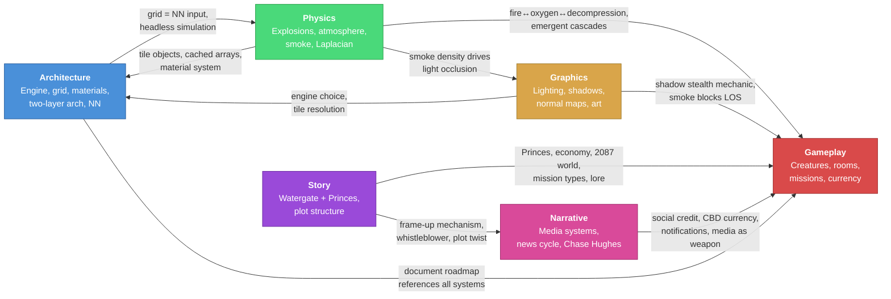

# Breach — Idea Association Map

How the design documents connect to each other through shared ideas.

## Document Key

| Short Name | File | Focus |
|---|---|---|
| **Architecture** | `00_architecture_overview.tex` | Engine, two-layer arch, grid/tile system, materials, language pipeline, NN training |
| **Gameplay** | `gameplay_ideas_collected.md` | Creatures, rooms, environmental systems, missions, currency, weapons, lore |
| **Graphics** | `graphics_lighting_design.md` | 2D raycasting light, normal maps, shadow stealth, smoke/light interaction, art pipeline |
| **Physics** | `map_and_physics_design.md` | Map class, Laplacian, explosions (wave eq), atmosphere (diffusion), smoke (advection) |
| **Story** | `story_research_watergate_and_princes.md` | Nixon Conspiracy + Princes of the Yen → plot architecture, character templates |
| **Narrative** | `docs/narrative_media_systems_update_2026-03-08.md` | Chase Hughes "6 Layers", news cycle, player as narrative subject, media systems |

---

## Association Diagram

---

## Idea Clusters (What Connects What)

### 1. Destructible Environment Chain
> Physics ↔ Graphics ↔ Gameplay

The core loop that ties three documents together:
- **Physics** defines *how* walls break (wave equation, pressure gradient damage, wall HP)
- **Graphics** defines *what happens visually* (light map recalculates, shadows shift, light floods through breaches)
- **Gameplay** defines *why it matters* (tactical routing, creature escape, emergent cascades)

Shared concepts: `gas_block` matrix, tile HP, material properties, hull breach

### 2. Smoke as Cross-System Glue
> Physics ↔ Graphics ↔ Gameplay

Smoke appears in three documents with different roles:
- **Physics**: diffusion + advection equations, carried by atmosphere gradient toward breaches
- **Graphics**: semi-transparent occluder, volumetric light shafts, feeds into `_light_block` cache
- **Gameplay**: vision blocker enabling stealth, tactical smoke grenades, fire byproduct

### 3. Material System
> Architecture ↔ Physics ↔ Gameplay

- **Architecture**: defines the data-driven material table (HP, flammable, blocks_light, blocks_gas, blast_resistance)
- **Physics**: uses `gas_block` and `blast_resistance` for propagation and wall destruction
- **Gameplay**: materials determine room behavior (wood burns, glass shatters, hull is tough)

### 4. The Princes / Central Bank
> Story ↔ Narrative ↔ Gameplay

The antagonist system spans three documents:
- **Story**: Princes of the Yen research → behavioral checklist, crisis-as-weapon, hidden credit control
- **Narrative**: Princes' *media apparatus* — news cycles, competing outlets, footage manipulation
- **Gameplay**: CBD currency (inflation mechanic), economy design, mission objectives ("audit the central bank")

### 5. The Frame-Up Plot
> Story ↔ Narrative ↔ Gameplay

The core plot thread:
- **Story**: Nixon Conspiracy structure → 5-phase plot (obvious crime → building case → anomalies → inversion → choice)
- **Narrative**: news system is the *mechanism* of the frame-up, player becomes narrative subject, context stripping
- **Gameplay**: mission types (Watergate break-ins, psy-ops, Kennedy-grade incidents), whistleblower clues

### 6. Grid / Tile Architecture
> Architecture ↔ Physics ↔ Graphics

The foundational data structure:
- **Architecture**: tile objects + cached arrays, 3×3 fine grid, entity list, double buffering
- **Physics**: all equations operate on the same grid, shared Laplacian function
- **Graphics**: tile-based sprites, normal maps match tile dimensions, light map is per-tile

### 7. Creatures ↔ Environmental Systems
> Gameplay ↔ Physics ↔ Graphics

Creatures are designed to interact with every environmental system:
- Blood (liquid layer) attracts predators → **Physics** liquid system
- Decompression sucks swarms through breaches → **Physics** atmosphere
- Smoke affects creature vision → **Graphics** LOS + **Physics** smoke density
- Fire blocks/damages all types → **Physics** fire + **Gameplay** tactical decisions

### 8. Stealth Mechanics
> Graphics ↔ Gameplay

- **Graphics**: shadow stealth = sample light intensity at tile, below threshold = hidden
- **Gameplay**: shoot out lights, use smoke, exploit dark rooms, creatures with enhanced senses (see through smoke?)

---

## Documents With No Direct Link

| Pair | Why |
|---|---|
| **Architecture ↔ Story** | Architecture is pure tech; story is pure narrative. They connect *through* Gameplay (mission structure) and Physics (simulation enables the world the story inhabits). |
| **Architecture ↔ Narrative** | Same — narrative media systems don't touch engine/grid decisions directly. |
| **Graphics ↔ Story** | No direct link. The political stage as "literal theatre" (Narrative doc) is a visual idea that would flow through Graphics eventually, but isn't there yet. |
| **Graphics ↔ Narrative** | The political theatre visual design (Part 5 of Narrative) is a future bridge. |
| **Physics ↔ Story** | No connection — physics doesn't touch plot. |
| **Physics ↔ Narrative** | No connection — though environmental destruction feeds into the news cycle indirectly (player causes events → news reports on them). |

---

## Heaviest Hub: Gameplay

`gameplay_ideas_collected.md` connects to **every other document**. It's the central hub — the place where technical systems, visual design, and narrative all converge into "what the player actually experiences." If any document needs to be split up, it's this one.
